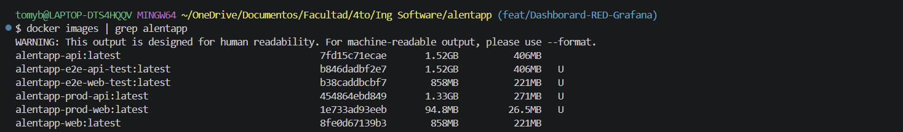
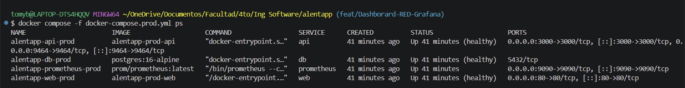
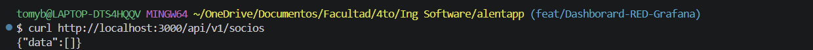
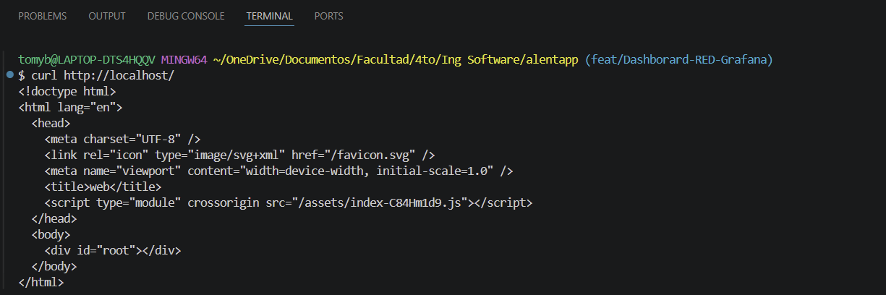
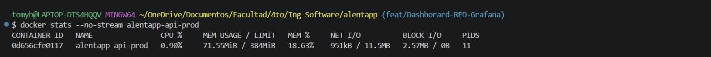
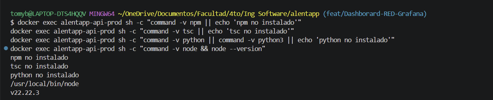
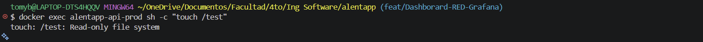
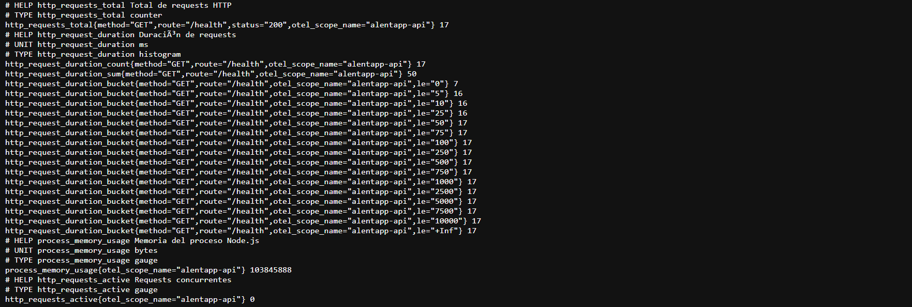
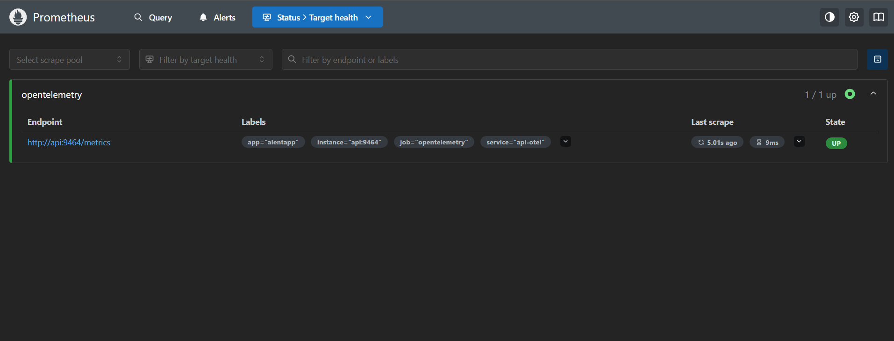
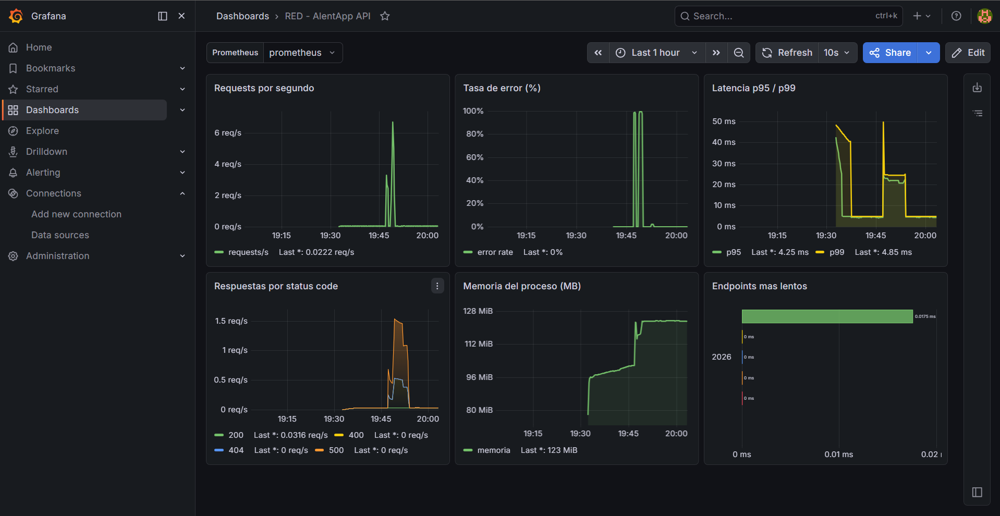

# Fase 4: Informe de verificación y entrega

> **Grupo:** 16  
> **Materia:** Ingeniería y Calidad de Software — 2026  
> **Proyecto:** AlentApp  
> **Fecha de medición:** 07/06/2026  
> **Integrantes:** Bellizzi Tomas, DeVida Facundo, Giordani Luca, Legorburu Lucas, Rodriguez Joaquin y Piquet Leonel

Este informe verifica que el diseño definido en [`diseno-grupo16.md`](./diseno-grupo16.md) (Fase 2) se cumple en el stack productivo implementado, y documenta las decisiones y problemas encontrados durante la entrega.

---

## 4.1. Verificación técnica

Comparación entre el stack de **desarrollo** (`docker-compose.yml`, `Dockerfile`) y el stack de **producción** (`docker-compose.prod.yml`, `Dockerfile.prod`).

### Tabla de métricas

| Métrica | Antes (desarrollo) | Después (producción) | Mejora |
|---------|-------------------|----------------------|--------|
| Tamaño imagen API — DISK USAGE | `docker images alentapp-api` → **1,51 GB** | `docker images alentapp-prod-api` → **563 MB** | **−947 MB (−63 %)** |
| Tamaño imagen API — CONTENT SIZE | **402 MB** | **119 MB** | **−283 MB (−70 %)** ✅ |
| Tamaño imagen Web | `docker images alentapp-web` → **858 MB** | `docker images alentapp-prod-web` → **94,8 MB** | **−763 MB (−89 %)** |
| Tiempo de startup API | `time docker compose up -d api` → **64,9 s** | `time docker compose -f docker-compose.prod.yml up -d api` → **6,9 s** | **−58 s (−89 %)** — ~9,4× más rápido |
| Tiempo hasta `healthy` (API) | Sin healthcheck en dev | **~6 s** tras el `up` (con `db` ya healthy) | Arranque verificable en prod |
| Memoria API (idle) | `docker stats --no-stream alentapp-api` → **81,0 MiB** | `docker stats --no-stream alentapp-api-prod` → **41,6 MiB** | **−39,4 MiB (−49 %)** |
| Endpoints accesibles | `curl http://localhost:3000/health` | `GET /health` → **200**, `GET /` → **200** | ✅ Operativos |
| Frontend vía nginx | Vite dev server `:5173` | `curl http://localhost:80/` → **200** | ✅ Nginx sirviendo estáticos |

> Las metas de tamaño y arranque provienen del diseño: API < 40 s y stack < 60 s (§2.1c de `diseno-grupo16.md`); Web ≤ 100 MB (§2.1b). Las metas de arranque y de Web se cumplen.

#### Hallazgo: la imagen de la API no alcanzaba el −70 % (y cómo se resolvió)

La primera medición de la imagen prod de la API dio **1,33 GB (solo −12,5 %)**, lejos de la meta del ~70 % (§3.4 del diseño) que sí cumplía Web (−89 %). Medir **dentro** de la imagen (`docker run … du -sh`) reveló que el peso **no estaba en las devDependencies** —el multi-stage ya las poda— sino en tres fuentes de runtime, atacadas en orden:

| Causa raíz | Peso | Corrección |
|------------|------|------------|
| `@opentelemetry/auto-instrumentations-node` instala ~40 instrumentaciones no usadas | ~37 MB | Instrumentación **explícita** HTTP + Fastify; meta-paquete eliminado |
| Prisma 7 arrastra herramientas dev como deps transitivas (`prisma` CLI, `@prisma/studio-core`, `@prisma/dev`, `@electric-sql/pglite`, `typescript`) | ~140 MB | **Poda** de esos paquetes en el stage `deps` (queries van por `@prisma/adapter-pg`, no por ellos) |
| `RUN chown -R node:node /app` reescribía todo `/app` en una capa nueva, **duplicando** `node_modules` | ~250 MB (disk) | Reemplazo por `COPY --chown=node:node`; se elimina la capa duplicada |

**Resultado tras las tres correcciones:**

| Métrica | Inicial | Final | Reducción |
|---------|---------|-------|-----------|
| DISK USAGE | 1,33 GB | **563 MB** | **−63 %** vs dev (1,51 GB) |
| CONTENT SIZE | 271 MB | **119 MB** | **−70 %** vs dev (402 MB) ✅ |

La meta del −70 % **se cumple medida por CONTENT SIZE** (el peso portable de la imagen, lo que se transfiere a un registry) y queda en −63 % por DISK USAGE (tamaño descomprimido en disco, dominado por el binario de Node que es irreducible con `node:alpine`).

**Verificación de no-regresión:** la imagen final arranca `healthy`, `/health` responde 200, `/metrics` sigue exportando las métricas RED y `GET /api/v1/lockers` ejecuta la query contra PostgreSQL (devuelve 500 solo porque la DB de prueba no tiene migraciones aplicadas, no por fallo de Prisma). Sin errores de módulo ni de engine en los logs.

**Consistencia:** el diseño se actualizó en consecuencia (§2.2b, §3.1 y §3.4 de `diseno-grupo16.md`), manteniendo código ↔ diseño ↔ informe alineados.

### Comandos utilizados

```bash
# Desarrollo
docker compose build
docker images alentapp-api alentapp-web
time docker compose up -d api
docker stats --no-stream alentapp-api

# Producción
docker compose -f docker-compose.prod.yml build
docker images alentapp-prod-api alentapp-prod-web
time docker compose -f docker-compose.prod.yml up -d api
docker stats --no-stream alentapp-api-prod

# Endpoints
curl -s http://localhost:3000/health
curl -s -o /dev/null -w "%{http_code}\n" http://localhost:80/
```

### Evidencia

**Tamaños de imagen (dev vs prod):**



`alentapp-api` (1,52 GB) → `alentapp-prod-api` (1,33 GB) y `alentapp-web` (858 MB) → `alentapp-prod-web` (94,8 MB).

**Stack productivo healthy:**



`db`, `api` y `web` en estado **healthy**; `prometheus` operativo. La `db` expone `5432/tcp` solo en la red interna (sin mapeo al host).

**Endpoint de la API y frontend vía Nginx:**





**Memoria de la API en idle:**



### Conclusiones

- La mejora más significativa está en **Web**: de una imagen con Node + dev server (858 MB) a Nginx + estáticos (94,8 MB), casi **9× más liviana**.
- La API de producción reduce **190 MB** de imagen (−12,5 %) y consume **la mitad de RAM** en idle (81 → 41,6 MiB).
- El arranque de la API en prod (**6,9 s** + **~6 s** hasta `healthy`) cumple el objetivo de diseño (< 40 s API, < 60 s stack).
- La imagen de API prod pasó de ~1,33 GB (−12,5 %) a **563 MB (−63 % disk / −70 % content)** tras tres correcciones: instrumentación OTel explícita, poda de las herramientas dev de Prisma 7 y eliminación de la capa duplicada de `chown` (ver hallazgo arriba). Cumple la meta del −70 % medida por content size.

> **Nota metodológica:** el tiempo de startup en dev (64,9 s) incluye levantar `db` y ejecutar `prisma migrate dev`. En prod se midió con `db` ya healthy, escenario típico de redeploy.

---

## 4.2. Verificación de seguridad

Confirmación de que cada medida de hardening del diseño (§2.1 de `diseno-grupo16.md`) funciona en el stack productivo.

| Medida | Comando / verificación | Resultado |
|--------|------------------------|-----------|
| API corre con usuario no-root | `docker exec alentapp-api-prod id` | ✅ `uid=1000(node)` |
| Web corre con usuario no-root | `docker exec alentapp-web-prod id` | ✅ `uid=101(nginx)` |
| No hay `npm` / `tsc` en imagen API final | `docker exec alentapp-api-prod which npm tsc` | ✅ No encontrados |
| No hay herramientas de build en runtime | Imagen final solo contiene `node dist/app.js` + deps prod | ✅ |
| Read-only filesystem (API) | `docker exec alentapp-api-prod touch /test` | ✅ `Read-only file system` |
| Read-only filesystem (Web) | `docker exec alentapp-web-prod touch /test` | ✅ `Read-only file system` |
| Capabilities mínimas | `cap_drop: [ALL]`; web solo `NET_BIND_SERVICE` | ✅ Configurado en compose |
| Variables sensibles vía `.env` | Credenciales en `.env` (gitignored), no en repo | ✅ |
| Healthchecks funcionando | `docker compose -f docker-compose.prod.yml ps` | ✅ `db`, `api`, `web` → **healthy** |
| DB no expuesta al host | Sin mapeo `5432:5432` en prod | ✅ Solo red interna `alentapp-prod` |

### Comandos de verificación

```bash
docker exec alentapp-api-prod id
docker exec alentapp-web-prod id
docker exec alentapp-api-prod which npm tsc
docker exec alentapp-api-prod touch /test
docker exec alentapp-web-prod touch /test
docker compose -f docker-compose.prod.yml ps
```

### Evidencia

**Ausencia de herramientas de build en la imagen final:**



**Filesystem de solo lectura:**



### Conclusiones

El stack productivo aplica correctamente el modelo de mínimo privilegio definido en `diseno-grupo16.md`: procesos no-root, filesystem de solo lectura en servicios stateless, capabilities reducidas y secretos externalizados.

---

## 4.3. Verificación de observabilidad

### Checklist de la consigna

| Ítem | Estado | Evidencia |
|------|--------|-----------|
| OpenTelemetry exporta métricas en `:9464/metrics` | ✅ Verificado | `curl http://localhost:9464/metrics` → 200 (captura abajo) |
| Prometheus scrapea el endpoint OTLP | ✅ Verificado | Job `opentelemetry` → `api:9464` en estado **UP** (`:9090/targets`) |
| Grafana tiene datasource Prometheus configurado | ✅ Verificado | Datasource `Prometheus` activo; dashboard consulta sobre él |
| Dashboard RED con 6 paneles funcionales | ✅ Verificado | `RED - AlentApp API` con sus 6 paneles renderizando datos |
| Gráficos responden al tráfico generado | ✅ Verificado | Picos de requests/s y status codes durante la prueba de carga |
| Métricas de error reflejan 4xx/5xx | ✅ Verificado | El panel de tasa de error subió a ~80 % al generar 404s |

### Métricas exportadas (verificado)

La API registra las cinco métricas RED definidas en el diseño (§2.2a). Nombres tal como los expone el `PrometheusExporter` en `:9464/metrics`:

| Métrica de diseño | Nombre en Prometheus | Tipo |
|-------------------|----------------------|------|
| Rate | `http_requests_total` | Counter |
| Errors | `http_requests_errors_total` | Counter |
| Duration | `http_request_duration_bucket` / `_count` / `_sum` | Histogram |
| Memoria del proceso | `process_memory_usage` | Gauge |
| Requests activas | `http_requests_active` | Gauge |



> El counter `http_requests_errors_total` solo aparece en `/metrics` tras la primera respuesta 4xx/5xx (OpenTelemetry no exporta series con valor cero). En la captura, tomada antes de generar errores, todavía no figura; sí aparece en Grafana tras la prueba de tráfico.

### Generación de tráfico de prueba

```bash
# Respuestas 2xx
for i in $(seq 1 50); do curl -s http://localhost:3000/health > /dev/null; done

# Respuestas 4xx
for i in $(seq 1 20); do curl -s http://localhost:3000/ruta-inexistente > /dev/null; done

# Verificar en el exporter
curl -s http://localhost:9464/metrics | grep http_requests
```

### Prometheus — target UP

`prometheus.yml` apunta al exporter de la API (`targets: ['api:9464']`, job `opentelemetry`). El target se scrapea correctamente:



- **Endpoint:** `http://api:9464/metrics`
- **Job:** `opentelemetry` · **Labels:** `app="alentapp"`, `service="api-otel"`
- **Estado:** `1 / 1 up` (**UP**), último scrape ~9 ms.

### Dashboard RED — 6 paneles

**Nombre del dashboard:** `RED - AlentApp API` (`uid: red-alentapp-api`) · **Datasource:** Prometheus · **Refresh:** 10 s.  
Definición versionada en [`observability/grafana/dashboards/red-metrics.json`](../../observability/grafana/dashboards/red-metrics.json).

| # | Panel | Query PromQL | Visualización | Resultado |
|---|-------|--------------|---------------|-----------|
| 1 | Requests por segundo | `sum(rate(http_requests_total[1m]))` | Time series | ✅ Pico ~6 req/s durante la carga |
| 2 | Tasa de error (%) | `100 * sum(rate(http_requests_errors_total[1m])) / clamp_min(sum(rate(http_requests_total[1m])), 1)` | Time series | ✅ Subió a ~80 % al generar 404s |
| 3 | Latencia p95 / p99 | `histogram_quantile(0.95, sum(rate(http_request_duration_bucket[5m])) by (le))` (+ p99) | Time series | ✅ p95 ~4 ms · p99 ~4,9 ms |
| 4 | Respuestas por status code | `sum by(status) (rate(http_requests_total[5m]))` | Time series (stacked) | ✅ Distingue 200 y 404 |
| 5 | Memoria del proceso (MB) | `process_memory_usage / 1024 / 1024` | Time series | ✅ Estable ~100 MB |
| 6 | Endpoints más lentos | `topk(5, sum by(route) (rate(http_request_duration_sum[5m])) / clamp_min(sum by(route) (rate(http_request_duration_count[5m])), 1))` | Bar chart horizontal | ✅ Duración promedio por ruta |

**Layout:** fila 1 → paneles 1–3 · fila 2 → paneles 4–6 (cada panel `w=8`, dos filas de tres).

> **Nota de implementación:** el panel 6 mide **duración promedio por ruta** (`rate(_sum)/rate(_count)`), no el p95 por ruta. Se eligió el promedio porque es estable con poco tráfico y suficiente para identificar la ruta más costosa; el p95/p99 global ya se cubre en el panel 3.



### Umbrales de referencia

| Señal | Umbral (diseño §2.2c) | Observado en prueba |
|-------|-----------------------|---------------------|
| Error rate | > 5 % | ~80 % durante la prueba intencional de 404s; ~0 % en operación normal |
| Latencia p95 | > 500 ms | ~4 ms (muy por debajo del umbral) |
| Memoria | Crecimiento sostenido | Estable ~100 MB, sin fugas observadas |

### Capturas de observabilidad

| Captura | Archivo |
|---------|---------|
| Métricas en `:9464/metrics` | `capturas/4-3-opentelemetry-metrics.png.png` |
| Prometheus target UP | `capturas/4-3-prometheus-target-up.png.png` |
| Dashboard RED completo (con tráfico) | `capturas/4-3-dashboard-red-grafana.png.png` |

---

## 4.4. Documentación de decisiones

### Arquitectura final

```txt
                    ┌─────────────────────────────────────────┐
                    │        Red: alentapp-prod (bridge)       │
                    │                                          │
  Host :80 ────────►│  web (nginx:stable-alpine)               │
                    │                                          │
  Host :3000 ──────►│  api (node:22-alpine, USER node)         │
  Host :9464 ──────►│       ├── Fastify :3000                  │
                    │       └── OTel PrometheusExporter :9464  │
                    │              ▲                           │
  Host :9090 ──────►│  prometheus ─┘ scrape (job opentelemetry)│
                    │              │                           │
                    │              ▼                           │
                    │  db (postgres:16-alpine, sin puerto host)│
                    └─────────────────────────────────────────┘
                                   ▲
                                   │ query (datasource Prometheus)
                          grafana (contenedor aparte) ──► dashboard "RED - AlentApp API"
```

> **Estado de Grafana:** Prometheus está integrado en `docker-compose.prod.yml`. Grafana se ejecutó como **contenedor independiente** (fuera del compose), con datasource Prometheus configurado e importando el dashboard versionado `observability/grafana/dashboards/red-metrics.json`. Integrarlo al compose con provisioning automático queda como follow-up (ver Anexo).

### Decisiones técnicas

| Decisión | Alternativa descartada | Justificación |
|----------|------------------------|---------------|
| Multi-stage build (API y Web) | Imagen única con devDeps | Imagen final sin fuentes, compilador ni `node_modules` de desarrollo; menor tamaño y superficie de ataque |
| Nginx para frontend en prod | Node + Vite dev server | Servidor especializado para estáticos; imagen de 94,8 MB vs 858 MB |
| OpenTelemetry + PrometheusExporter `:9464` | Push gateway / logs manuales | Convención estándar OTel; protocolo pull nativo de Prometheus |
| Hooks globales Fastify para métricas RED | Instrumentar cada controller | Captura 404s y errores sin handler; un solo punto de registro |
| `read_only` + `cap_drop: ALL` | Contenedores sin restricciones | Mínimo privilegio; limita daño ante compromiso |
| Healthcheck con `127.0.0.1` | `localhost` | En Alpine, `localhost` resuelve a IPv6 (`::1`) y Fastify escucha en IPv4 |
| Migraciones fuera del compose | `prisma migrate` en `CMD` | Separación deploy/migración; imagen inmutable |
| Secretos en `.env` | Credenciales en compose | No se commitean; rotación sin rebuild de imagen |
| Panel 6 con promedio de latencia | `histogram_quantile` por ruta | Estable con poco tráfico; el p95/p99 global ya se cubre en el panel 3 |

### Problemas encontrados

| Problema | Causa raíz | Solución aplicada |
|----------|------------|-------------------|
| API `unhealthy` en prod | Entrypoint solo arrancaba con sufijo `app.ts`; Dockerfile ejecuta `app.js` | Guard en `app.ts` para `app.ts` y `app.js` |
| Healthcheck fallaba con API operativa | `localhost` → `::1`; Fastify en `0.0.0.0:3000` (IPv4) | Healthcheck en `127.0.0.1:3000` (Dockerfile + compose) |
| `ERR_MODULE_NOT_FOUND` (Prisma) | Client generado no incluido en imagen final | `prisma generate` en stage `build` + `COPY` a `dist/generated/client` |
| `DATABASE_URL` vacía al arrancar | Compose no expande `${VAR}` anidadas dentro del `.env` | URL completa en `.env` |
| Prometheus targets `down` | `prometheus.yml` apuntaba a `host.docker.internal` | ✅ Resuelto: `targets: ['api:9464']` (job `opentelemetry`) → target **UP** |
| Imagen API no alcanzaba el −70 % (1,33 GB) | (1) `auto-instrumentations-node` con ~40 instrumentaciones; (2) Prisma 7 con herramientas dev como deps transitivas; (3) `RUN chown -R /app` duplicaba `node_modules` en una capa nueva | ✅ (1) instrumentación explícita; (2) poda de Prisma dev en stage `deps`; (3) `COPY --chown`. Resultado: **563 MB (−63 % disk / −70 % content)**. Diseño actualizado (§2.2b, §3.1, §3.4) |

### Lecciones aprendidas

- **Lo más difícil:** la integración entre Dockerfile, compose y código de aplicación (entrypoint, healthcheck IPv6, Prisma Client) — errores que no aparecen en build sino en runtime.
- **Qué cambiaríamos:** implementar Grafana provisionado dentro del compose desde la misma iteración que la telemetría, para validar el pipeline completo de forma reproducible (hoy Grafana corre como contenedor aparte).
- **Qué funcionó bien:** el multi-stage build de Web (89 % menos de imagen), el hardening del compose con verificación automatizable vía `docker exec`, y el pipeline OTel → Prometheus → Grafana, que mostró las métricas RED respondiendo al tráfico de prueba.
- **Verificación que retroalimentó el diseño:** medir la imagen expuso que la meta de tamaño de la API no se cumplía por una dependency de runtime (`auto-instrumentations-node`), no por el empaquetado. Corregirlo en código y reflejarlo en el diseño es un ejemplo de cómo la fase de verificación mejora decisiones tomadas en diseño.

### Capturas de pantalla

| Captura | Descripción | Archivo |
|---------|-------------|---------|
| Servicios healthy | `docker compose ps` con servicios healthy | `capturas/4-1-compose-prod-healthy.png.png` |
| Checks de seguridad | Read-only filesystem y sin herramientas de build | `capturas/4-2-read-only-filesystem.png.png`, `capturas/4-2-no-build-tools.png.png` |
| Dashboard RED | Dashboard RED con datos en vivo | `capturas/4-3-dashboard-red-grafana.png.png` |

---

## 4.5. Presentación (10 minutos)

### Guión

| Min | Tema | Contenido |
|-----|------|-----------|
| 0–1 | Introducción | AlentApp, objetivo del TP, dev vs prod |
| 1–3 | Antes y después | Tabla §4.1: imágenes (−89 % Web), startup (9,4×), memoria (−49 %) |
| 3–5 | Seguridad | Demo en vivo: `docker exec id`, `touch /test`, `docker ps` |
| 5–8 | Demo dashboard RED | Levantar stack → generar tráfico → mostrar los 6 paneles en Grafana |
| 8–10 | Lecciones aprendidas | Entrypoint, IPv6, Prisma, pipeline de observabilidad |

### Demo de observabilidad

1. `docker compose -f docker-compose.prod.yml up -d`
2. Verificar `http://localhost:9464/metrics` y `http://localhost:9090/targets` (target `opentelemetry` **UP**)
3. Abrir Grafana → dashboard `RED - AlentApp API`
4. Ejecutar script de tráfico (§4.3): 50× `/health` (2xx) + 20× `/ruta-inexistente` (4xx)
5. Mostrar cómo suben requests/s, aparecen 404 en el panel de status codes, sube la tasa de error y se actualiza la memoria

### Material de apoyo

- Diseño: [`diseno-grupo16.md`](./diseno-grupo16.md)
- Stack: [`docker-compose.prod.yml`](../../docker-compose.prod.yml)
- Dashboard: [`observability/grafana/dashboards/red-metrics.json`](../../observability/grafana/dashboards/red-metrics.json)
- Informe: este documento

---

## Anexo: estado de la entrega

| Pendiente original | Estado |
|--------------------|--------|
| Corregir `observability/prometheus/prometheus.yml` → `targets: ['api:9464']` | ✅ Hecho |
| Crear dashboard RED (JSON) con los 6 paneles y queries de §4.3 | ✅ Hecho (`red-metrics.json`) |
| Ejecutar tráfico de prueba y validar respuesta de gráficos | ✅ Hecho |
| Agregar capturas en `docs/produccion/capturas/` | ✅ Hecho |
| Completar columnas ⏳ de §4.3 y demo de §4.5 | ✅ Hecho |
| Completar nombres de integrantes en el encabezado | ✅ Hecho |
| Agregar servicio `grafana` a `docker-compose.prod.yml` con provisioning | ⏳ Follow-up — hoy Grafana corre como contenedor independiente con el dashboard importado manualmente |
| Re-medir imagen API tras optimización y completar §4.1 | ✅ Hecho — 563 MB (−63 % disk / −70 % content) |

### Rebuild y re-medición de la imagen de la API

> Ya ejecutado; los comandos quedan documentados para reproducir la medición. Tras quitar `@opentelemetry/auto-instrumentations-node`, el `package-lock.json` quedó desactualizado. Como el `Dockerfile.prod` usa `npm ci` (que exige lock sincronizado), **primero hay que regenerar el lock** y recién después rebuildear:

```bash
# 1. Sincronizar el lockfile con el package.json modificado (desde la raíz del repo)
npm install

# 2. Rebuild de la imagen de producción de la API (sin caché, para medición limpia)
docker compose -f docker-compose.prod.yml build --no-cache api

# 3. Ver el tamaño de la imagen prod de la API
docker images alentapp-prod-api

#    Comparar contra dev de un vistazo:
docker images | grep alentapp

# 4. (Opcional) Verificar que la API sigue arrancando healthy con la nueva imagen
docker compose -f docker-compose.prod.yml up -d api
docker compose -f docker-compose.prod.yml ps
curl -s http://localhost:3000/health
curl -s http://localhost:9464/metrics | grep http_requests   # confirmar que OTel sigue exportando

# 5. Calcular la reducción:  reducción % = (1 - tamaño_prod / 1.52GB) * 100
```

> Con el tamaño nuevo de `alentapp-prod-api`, completar la fila **"tras optimización OTel"** de la tabla de §4.1 y su columna de reducción. Si el target del −70 % aún no se alcanza, el siguiente lever es Prisma 7: generar el client con driver adapter sin el query engine Rust (`@prisma/adapter-pg` ya está en uso).
